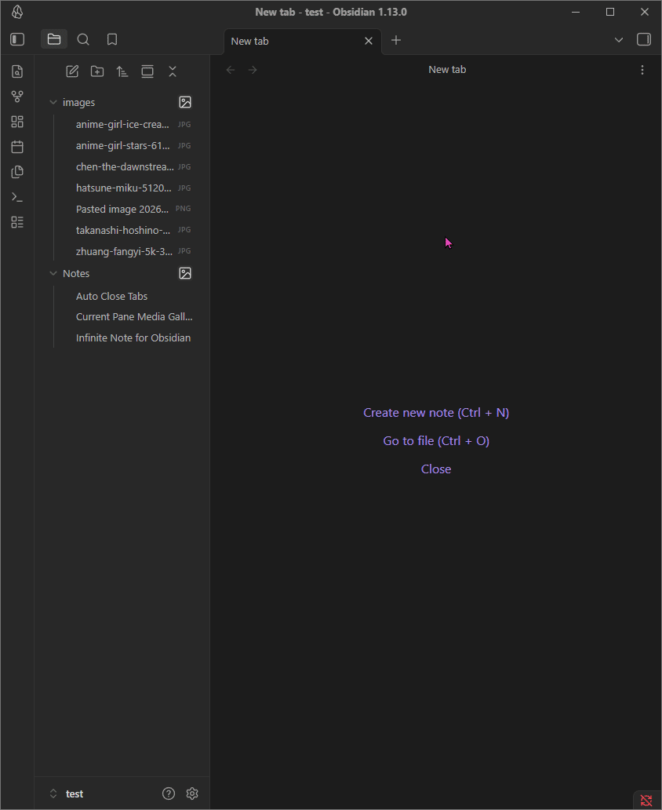

# Obsidian Folder as Gallery

An Obsidian plugin that allows you to view the contents of any folder as a beautiful, responsive media gallery in a new tab. Perfect for users who store images, videos, and visual notes in their vaults.

## ✨ Features

- **File Explorer Integration:** Adds a convenient gallery icon next to every folder in your navigation pane.
- **Media Support:** Displays thumbnails for all images (`.png`, `.jpg`, `.gif`, etc.) and videos (`.mp4`, `.webm` with hover-to-play preview!).
- **Smart Note Preview (`.md` files):** If a folder contains markdown notes, the plugin will automatically find the first image inside the note and use it as a cover thumbnail! If no image is found, it renders a neat text preview of the note.
- **Breadcrumb Navigation:** Tab titles display the full folder path (e.g., `Parent > Child`) so you always know exactly which folder you are browsing.
- **Live Search Filter:** Includes a fixed search bar at the top of the gallery to quickly filter files by name.
- **Customizable:** Adjust the standard thumbnail size easily from the plugin settings.
- **High Compatibility:** Includes a "Force Right" option to ensure the gallery icon plays nicely with other plugins that modify the file explorer (like File Explorer Note Count).

## 🚀 How to Use

1. Hover over any folder in the standard Obsidian File Explorer (left pane).
2. Click the **Gallery Icon** that appears on the right side of the folder name.
3. A new tab will open displaying all media and notes inside that folder as a visual grid.
4. Click on any thumbnail to open the actual file in Obsidian.
5. Use the **search bar** at the top of the gallery to filter files instantly.

### ⚙️ Settings

You can customize the plugin behavior in **Settings > Community Plugins > Folder as Gallery**:
- **Thumbnail Size (px):** Use the slider to increase or decrease the size of the gallery thumbnails (100px - 500px).
- **Force Icon to Far Right:** Enable this if the gallery icon overlaps or conflicts with elements from other plugins.

## 📦 Manual Installation

1. Download the latest release (`main.js`, `manifest.json`, `styles.css`) from the Releases page.
2. Create a folder named `obsidian-plugins-folder-as-gallery` inside your vault's `.obsidian/plugins/` directory.
3. Place the downloaded files into that folder.
4. Reload Obsidian and enable the plugin in **Settings > Community Plugins**.

## ❤️ Support & Donate

If this plugin has improved your Obsidian workflow, saved you time, or you just want to support its continued development, please consider donating! 

Your support is incredibly appreciated, helps fix bugs, and keeps this project alive and growing. 🙏

https://buymeacoffee.com/endofday

---
**Built with ❤️ for the Obsidian Community**
